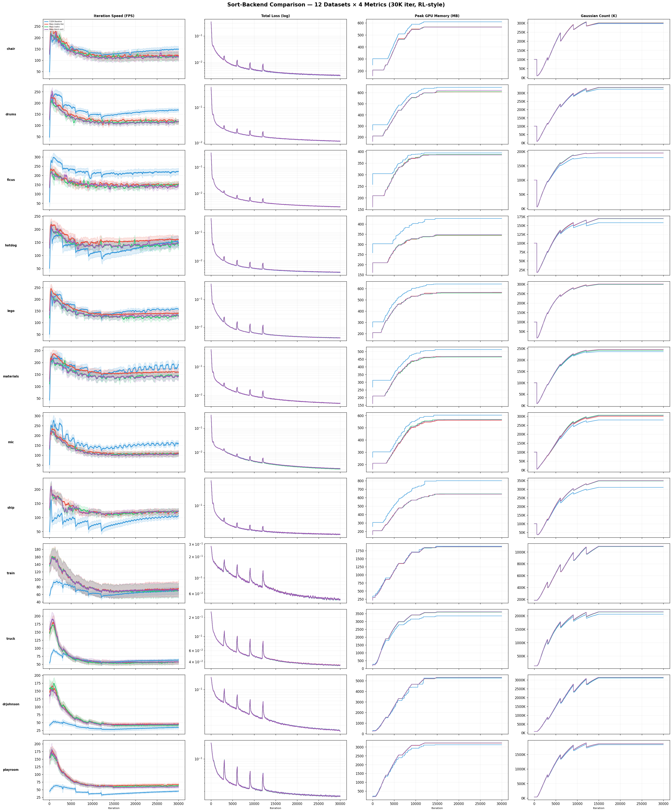

# gswarp

[English](README.md) · **中文**

一个基于 **纯 Python + NVIDIA Warp** 的可微高斯光栅化管线重新实现，原始版本以 CUDA C++ 编写，用于 [3D Gaussian Splatting](https://repo-sam.inria.fr/fungraph/3d-gaussian-splatting/)。本后端提供了与原生 CUDA 光栅化器的 **直接替换**（drop-in replacement）——无需 C++/CUDA 编译。

> **许可证**：本项目继承 [Gaussian-Splatting 许可证](LICENSE)（Inria 和 MPII，仅限非商业研究使用）。

---

## 目录

- [特性](#特性)
- [系统要求](#系统要求)
- [安装](#安装)
- [快速开始](#快速开始)
- [API 参考](#api-参考)
- [架构概览](#架构概览)
- [与 CUDA 基线的差异](#与-cuda-基线的差异)
- [正确性](#正确性)
- [性能特征](#性能特征)
- [已知限制](#已知限制)
- [未来优化方向](#未来优化方向)
- [致谢](#致谢)

---

## 特性

- **完整的光栅化管线**：预处理 → 分箱 → 前向渲染 → 反向渲染，全部由 Warp 内核实现。
- **直接替换**：API 与原生 CUDA 后端兼容——只需更改导入路径即可切换后端。
- **无需编译**：纯 Python + Warp JIT。不需要 `setup.py build_ext`，不需要 CUDA 工具链头文件，没有平台相关的构建问题。
- **协作式瓦片加载（前向）**：block_dim=256 的前向渲染 kernel 通过 `wp.tile()` + `wp.tile_extract()` 实现协作式高斯数据加载，消除逐像素冗余全局内存读取。
- **Warp 级梯度归约（反向）**：block_dim=32 的反向渲染 kernel 通过 `wp.tile_reduce()` 实现纯 warp shuffle 梯度归约，原子写入减少 32 倍。
- **球谐函数**：0–3 阶，与原始实现一致。
- **自动调优**：基于 GPU SM 架构的占用率感知内核块维度选择（支持 Volta 到 Blackwell）。
- **多种分箱排序模式**：`warp_depth_stable_tile`（默认，推荐）、`warp_radix`、`torch`。
- **融合反向内核**：合并分配和梯度累积步骤，减少内核启动开销。
- **紧凑 AABB 瓦片剔除**：使用逐轴 3σ 包围盒进行高斯到瓦片的分配（受 [Zhang et al., 2025](https://arxiv.org/abs/2601.19489) 启发），减少细长高斯的不必要瓦片重叠。
- **深度计算跳过**：可选关闭逐像素深度累积（`GSWARP_COMPUTE_DEPTH=0`），在不使用深度 loss 时节省 ~5% 迭代时间。
- **自动缓存清理**：高斯点数大幅下降时（>20% 下降）自动清理 Warp 缓存，确保 densification/pruning 后缓存以最优大小重建。
- **前向状态打包**：高效的前向状态序列化，供反向传播重用，避免冗余重算。

---

## 系统要求

| 组件 | 最低版本 | 测试版本 |
|------|---------|---------|
| **Python** | 3.10+ | 3.14.3 |
| **NVIDIA GPU** | 计算能力 ≥ 7.0（Volta） | RTX 5090D V2（sm_120，24 GiB）|
| **NVIDIA 驱动** | 兼容 CUDA 12.x | 595.79 |
| **PyTorch** | 2.0+（含 CUDA 支持） | 2.11.0+cu130 |
| **NVIDIA Warp** | 1.12.0+ | 1.12.0 |

SM 架构自动调优表覆盖以下架构：

| 架构 | 计算能力 |
|------|---------|
| Volta | 7.0 |
| Turing | 7.5 |
| Ampere (GA100) | 8.0 |
| Ampere (GA10x) | 8.6 |
| Ada Lovelace | 8.9 |
| Hopper | 9.0 |
| Blackwell | 10.0 |

不在此表中的 GPU 仍可正常工作——自动调优会回退到保守的默认参数。

---

## 安装

### 1. 安装依赖

```bash
pip install torch --index-url https://download.pytorch.org/whl/cu126
pip install warp-lang>=1.12.0
```

### 2. 克隆并集成

将本仓库作为 3DGS 项目（或任何使用 `gswarp` 的项目）的子模块：

```bash
git clone https://github.com/fancifulland2718/gswarp.git submodules/gswarp
```

### 3.（可选）构建原生 CUDA 基线用于对比

如果您还需要原生 CUDA 光栅化器（用于 A/B 测试或回退）：

```bash
cd submodules/gswarp
pip install .
```

> **注意**：Warp 后端本身 **不需要** `pip install .` 或任何原生编译。直接通过 Python 导入即可运行。

---

## 快速开始

### 使用 Warp 后端

```python
# 导入 Warp 后端（替代原生 CUDA 后端）
from gswarp.warp import (
    GaussianRasterizationSettings,
    GaussianRasterizer,
    initialize_runtime_tuning,
)

# （可选）初始化运行时自动调优——检测 GPU 并选择最优参数
initialize_runtime_tuning(device="cuda:0", verbose=True)

# 配置光栅化设置
raster_settings = GaussianRasterizationSettings(
    image_height=height,
    image_width=width,
    tanfovx=tanfovx,
    tanfovy=tanfovy,
    bg=bg_color,          # [3] 张量，背景颜色
    scale_modifier=1.0,
    viewmatrix=viewmatrix,     # [4, 4] 世界到相机矩阵
    projmatrix=projmatrix,     # [4, 4] 完整投影矩阵
    sh_degree=active_sh_degree,
    campos=campos,             # [3] 世界空间中的相机位置
    prefiltered=False,
    # Warp 特有的可选字段：
    backward_mode="manual",              # 仅支持 "manual"
    binning_sort_mode="warp_depth_stable_tile",  # 或："warp_radix", "torch"
    auto_tune=True,
    auto_tune_verbose=True,
)

# 创建光栅化器并运行前向传播
rasterizer = GaussianRasterizer(raster_settings=raster_settings)
color, radii, depth, alpha, proj_2D, conic_2D, conic_2D_inv, gs_per_pixel, weight_per_gs_pixel, x_mu = rasterizer(
    means3D=means3D,           # [N, 3]
    means2D=means2D,           # [N, 3]（屏幕空间，接收梯度）
    opacities=opacities,       # [N, 1]
    shs=shs,                   # [N, K, 3] 球谐系数
    scales=scales,             # [N, 3]
    rotations=rotations,       # [N, 4] 四元数
)

# 反向传播通过 PyTorch autograd 自动完成
loss = compute_loss(color, target)
loss.backward()
```

### 从原生 CUDA 切换到 Warp

替换您的导入语句：

```python
# 之前（原生 CUDA）：
from gswarp import GaussianRasterizationSettings, GaussianRasterizer

# 之后（Warp 后端）：
from gswarp.warp import GaussianRasterizationSettings, GaussianRasterizer
```

Warp 后端的前向输出元组比原生版本返回更多输出：

```python
# 原生 CUDA 输出：
color, radii = rasterizer(...)

# Warp 后端输出：
color, radii, depth, alpha, proj_2D, conic_2D, conic_2D_inv, gs_per_pixel, weight_per_gs_pixel, x_mu = rasterizer(...)
```

---

## API 参考

### 核心函数

| 函数 | 描述 |
|------|------|
| `rasterize_gaussians(...)` | 完整前向传播：预处理 + 分箱 + 渲染 |
| `rasterize_gaussians_backward(...)` | 完整反向传播：反向渲染 + 反向预处理 |
| `mark_visible(positions, viewmatrix, projmatrix)` | 返回 3D 位置的可见性掩码 |
| `preprocess_gaussians(...)` | 仅预处理（不渲染），用于分析 |

### 运行时配置

| 函数 | 描述 |
|------|------|
| `initialize_runtime_tuning(device, verbose)` | 一次性 GPU 检测和参数调优 |
| `get_runtime_tuning_report(device)` | 获取当前调优报告（内存、瓦片大小、排序模式） |
| `get_runtime_auto_tuning_config()` | 获取自动调优开关状态 |
| `set_binning_sort_mode(mode)` | 运行时设置分箱排序模式 |
| `get_default_parameter_info()` | 获取编译时常量（TOP_K、BLOCK_X 等） |
| `is_available()` | 检查 Warp 是否可导入 |

### GaussianRasterizationSettings 字段

| 字段 | 类型 | 描述 |
|------|------|------|
| `image_height` | `int` | 输出图像高度（像素） |
| `image_width` | `int` | 输出图像宽度（像素） |
| `tanfovx` | `float` | tan(FoV_x / 2) |
| `tanfovy` | `float` | tan(FoV_y / 2) |
| `bg` | `Tensor[3]` | 背景颜色 |
| `scale_modifier` | `float` | 全局缩放乘数 |
| `viewmatrix` | `Tensor[4,4]` | 世界到相机变换矩阵 |
| `projmatrix` | `Tensor[4,4]` | 完整投影矩阵 |
| `sh_degree` | `int` | 活跃球谐阶数（0–3） |
| `campos` | `Tensor[3]` | 世界空间中的相机位置 |
| `prefiltered` | `bool` | 点是否已预过滤 |
| `backward_mode` | `str \| None` | `"manual"`（唯一支持的模式） |
| `binning_sort_mode` | `str \| None` | 分箱排序算法 |
| `auto_tune` | `bool` | 启用自动调优（默认：`True`） |
| `auto_tune_verbose` | `bool` | 打印调优信息（默认：`True`） |

---

## 架构概览

### 管线阶段

```
输入高斯（means3D, SH, scales, rotations, opacities）
    │
    ▼
┌─────────────────────────────────┐
│  1. 预处理（PREPROCESS）         │
│  - 从 scale+rotation 计算 Cov3D  │
│  - 投影到 2D（cov2d, conic）     │
│  - 视锥 + 近平面剔除             │
│  - SH → RGB 颜色评估             │
│  - 紧凑 AABB 瓦片矩形            │
│  - 前向状态打包                   │
└─────────────────────────────────┘
    │
    ▼
┌─────────────────────────────────┐
│  2. 分箱（BINNING）              │
│  - 瓦片重叠计数（scan）           │
│  - 高斯→瓦片复制                 │
│  - 深度排序 + 瓦片排序            │
│  - 瓦片范围标识                   │
└─────────────────────────────────┘
    │
    ▼
┌──────────────────────────────────────────┐
│  3. 前向渲染（FORWARD RENDER）            │
│  - block_dim=256 协作瓦片加载             │
│    (wp.tile + wp.tile_extract)           │
│  - 逐像素 alpha 混合                     │
│  - 从前到后合成                           │
│  - 透射率阈值提前终止                     │
│  - 颜色、深度、alpha 输出                 │
└──────────────────────────────────────────┘
    │
    ▼
┌──────────────────────────────────────────┐
│  4. 反向渲染（BACKWARD RENDER）           │
│  - block_dim=32 warp 级梯度归约           │
│    (wp.tile_reduce → warp shuffle)       │
│  - 渲染关于 conic、opacity、              │
│    color、pos 的梯度                      │
│  - 32× 更少的 atomic_add 写入            │
└──────────────────────────────────────────┘
    │
    ▼
┌─────────────────────────────────┐
│  5. 反向预处理（BACKWARD PREPROCESS）│
│  - 预处理关于 means3D、scales、   │
│    rotations 的梯度               │
│  - SH 反向传播                    │
│  - Cov3D → scale/rotation 梯度   │
└─────────────────────────────────┘
```

### 单文件设计

整个 Warp 后端包含在一个 Python 文件中（约 4100 行），包括：

- 所有 Warp 内核定义（`@wp.kernel`）
- 所有 Warp 辅助函数（`@wp.func`）
- 运行时自动调优
- 公共 API 函数

这是有意为之的——Warp 的 JIT 编译模型要求所有内核代码及其依赖项必须在同一个 `wp.Module` 作用域内。拆分到多个文件会破坏 Warp 在 JIT 时对 `@wp.func` 交叉引用的解析能力。

### 关键常量

| 常量 | 值 | 描述 |
|------|---|------|
| `BLOCK_X` | 16 | 瓦片宽度（像素） |
| `BLOCK_Y` | 16 | 瓦片高度（像素） |
| `NUM_CHANNELS` | 3 | RGB 输出通道 |
| `RENDER_TILE_BATCH` | 32 | 前向 kernel 每轮协作加载到共享内存的高斯数量 |
| `PREPROCESS_CULL_SIGMA` | 3.0 | 视锥剔除 sigma 乘数 |
| `PREPROCESS_CULL_FOV_SCALE` | 1.3 | 剔除用 FoV 边界缩放 |
| `VISIBILITY_NEAR_PLANE` | 0.2 | 剔除用近平面距离 |

---

## 与 CUDA 基线的差异

### 1. 紧凑 AABB vs 各向同性半径

本项目采用的紧凑 AABB 包围盒方法受到论文 *[Fast Converging 3D Gaussian Splatting for 1-Minute Reconstruction](https://arxiv.org/abs/2601.19489)*（Ziyu Zhang, Tianle Liu, Diantao Tu, Shuhan Shen, arXiv:2601.19489）的启发。该技术使用从 2D 协方差矩阵派生的逐轴范围替代各向同性的正方形半径，为各向异性高斯提供更紧凑的瓦片分配。本项目未引入额外的代码依赖，仅采纳了包围盒计算逻辑。

**CUDA 基线**使用两个特征值派生半径中的最大值计算正方形包围盒：

```c
// CUDA: auxiliary.h getRect()
int max_radius = ...;  // max(ceil(3σ_max), 0), 各向同性
rect_min = {min(grid.x, max((int)((point.x - max_radius) / BLOCK_X), 0)), ...};
rect_max = {min(grid.x, max((int)((point.x + max_radius + BLOCK_X - 1) / BLOCK_X), 0)), ...};
```

**Warp 后端**使用 2D 协方差矩阵的对角元素计算逐轴的紧凑包围盒：

```python
# Warp: _compute_tile_rect_tight_wp()
radius_x = wp.int32(wp.ceil(3.0 * wp.sqrt(wp.max(cov_xx, 0.01))))
radius_y = wp.int32(wp.ceil(3.0 * wp.sqrt(wp.max(cov_yy, 0.01))))
```

**影响**：
- 对于 **细长高斯**（高各向异性），Warp 后端分配的瓦片更少，减少了 `num_rendered`，提高了分箱/渲染效率。
- 对于 **圆形高斯**，两种方法等价。
- 这引入了微小的不匹配：CUDA 基线由于过于保守的各向同性半径而包含的一些边界瓦片，被 Warp 的更紧凑边界排除。视觉差异可忽略不计，但在数值比较中可检测到。

### 2. 部分协作式瓦片加载（通过 Warp Tile API）

**CUDA 基线**使用显式 `__shared__` 内存进行协作式数据获取——瓦片中的 256 个线程协作地将高斯数据从全局内存加载到共享内存，然后遍历共享缓冲区：

```c
// CUDA: forward.cu renderCUDA()
__shared__ int collected_id[BLOCK_SIZE];
__shared__ float2 collected_xy[BLOCK_SIZE];
__shared__ float4 collected_conic_opacity[BLOCK_SIZE];

for (int j = 0; !done && j < min(BLOCK_SIZE, toDo); j++) {
    float2 xy = collected_xy[j];
    float4 con_o = collected_conic_opacity[j];
    ...
}
```

**Warp 后端**无法直接声明和操作 `__shared__` 变量，但通过 Warp 的 Tile API（`wp.tile()` + `wp.tile_extract()`）间接实现了协作式加载。前向渲染 kernel 使用 block_dim=256（对应一个 16×16 像素瓦片），每轮迭代中每个线程加载 1 个高斯，然后所有线程通过 `wp.tile_extract()` 从 tile 中读取其他线程加载的数据：

```python
# Warp: _render_tiles_tiled256_warp_kernel
# 每个线程加载 1 个高斯（协作式）
my_xy = points_xy_image[my_id]
my_co = conic_opacity[my_id]
t_xy = wp.tile(my_xy, preserve_type=True)
t_co = wp.tile(my_co, preserve_type=True)

# 所有 256 个线程共享这批数据
for j in range(batch_count):
    xy_j = wp.tile_extract(t_xy, j)
    co_j = wp.tile_extract(t_co, j)
    ...
```

这在效果上等价于 CUDA 的共享内存协作获取模式——全局内存读取被分摊到瓦片中的所有线程。但受限于 Warp Tile API 的约束：
- `wp.tile()` 总是创建 block 级别的 tile，无法创建 warp 级别的 tile
- 每次 `wp.tile()` 调用会隐式涉及 `__syncthreads`
- 无法直接控制共享内存的布局或对齐方式

**反向渲染 kernel** 使用 block_dim=32（单 warp），采用 `wp.tile_reduce()` 进行梯度归约。在单 warp 配置下，`tile_reduce` 编译为纯 warp shuffle（`__shfl_down_sync`），无需 `__syncthreads` 或共享内存，是 Warp API 下反向梯度归约的最优配置。

**影响**：
- 前向渲染在所有规模下都已接近 CUDA 基线的效率，协作加载消除了原先每高斯 256× 的冗余全局内存读取。
- 反向渲染同样高效——warp 级归约将 atomic 写入减少了 32 倍。
- 但 Warp Tile API 在灵活性上仍不如直接操作 `__shared__` 内存，例如无法实现复杂的 double buffering 或自定义 bank conflict 规避策略。

### 3. 排序差异

**CUDA 基线**使用单次 CUB `DeviceRadixSort`，键为 64 位打包格式（`(tile_id << 32) | depth_bits`）。

**Warp 后端**默认模式（`warp_depth_stable_tile`）使用两次排序：
1. 第一次：按深度排序（Warp 基数排序）
2. 第二次：按瓦片 ID 稳定排序（Warp 基数排序）

这导致每个瓦片内的高斯排序与 CUDA 基线不同，进而在 alpha 混合期间产生不同的浮点累积顺序。由于浮点运算的非结合性，像素级输出会有微小差异。

### 4. 剔除参数

Warp 后端应用显式的视锥剔除参数：
- `PREPROCESS_CULL_SIGMA = 3.0`：3σ 包围盒完全在图像外的高斯被剔除
- `PREPROCESS_CULL_FOV_SCALE = 1.3`：略微扩展 FoV 以避免过度边界剔除

这与 CUDA 基线的隐式剔除行为略有不同。

### 5. 调度方式差异

CUDA 基线以瓦片块的 2D 网格调度渲染内核：
```c
dim3 grid((width + BLOCK_X - 1) / BLOCK_X, (height + BLOCK_Y - 1) / BLOCK_Y, 1);
dim3 block(BLOCK_X, BLOCK_Y, 1);
```

Warp 后端以 1D 方式调度，但同样以瓦片为单位——每个瓦片对应 256 个线程（16×16 像素）：
```python
# 前向：block_dim=256，每个 block = 一个瓦片
_dim = num_tiles * 256
wp.launch(kernel, dim=_dim, block_dim=256, ...)
```

瓦片索引在内核内通过 `wp.tid()` 算术推导（`tile_id = tid // 256`，`local_id = tid % 256`）。功能等价，但 1D 调度的线程映射方式略有不同。

反向渲染 kernel 使用 block_dim=32（单 warp），每个 warp 覆盖一个相同的 16×16 瓦片的全部像素，但每个线程仅对应 tile 中的约 8 个像素。

---

## 正确性

### 随机粒子正确性（256K–2048K）

在 256K–2048K 规模的随机粒子下，使用公共 API 对 Native CUDA 与 Warp 后端的前向渲染输出和反向梯度进行数值一致性验证。测试配置：`backward_mode="manual"`、`binning_sort_mode="warp_depth_stable_tile"`、`auto_tune=True`。测试平台：**NVIDIA RTX 5090D V2**，PyTorch 2.11.0+cu130，Warp 1.12.0。

#### 前向：渲染颜色差异

| 规模 | 分辨率 | 最大绝对误差 | 平均绝对误差 |
|------|--------|------------|------------|
| 256K | 384×384 | 0.0108 | 4.01e-05 |
| 512K | 512×512 | 0.0064 | 3.37e-05 |
| 1024K | 640×640 | 0.0077 | 2.78e-05 |
| 2048K | 800×800 | 0.0033 | 1.74e-05 |

最大单像素误差 < 0.011（值域 [0,1]），平均绝对误差在 1e-5 数量级。随规模增大，误差反而略有下降，说明差异并非系统性偏差而是稀疏离群像素。两个后端使用不同的 tile 排序实现和浮点累加顺序，产生数值级别的微小差异。

#### 反向：梯度差异

| 规模 | 梯度字段 | 最大绝对误差 | 平均绝对误差 |
|------|----------|------------|------------|
| 256K | `grad_means3D` | 35.78 | 0.00114 |
| | `grad_shs` | 1.75 | 6.68e-05 |
| | `grad_scales` | 152.56 | 0.00607 |
| | `grad_rotations` | 12.11 | 3.95e-04 |
| | `grad_opacities` | 2.38 | 1.56e-04 |
| 1024K | `grad_means3D` | 89.53 | 5.63e-04 |
| | `grad_shs` | 6.36 | 4.97e-05 |
| | `grad_scales` | 1014.70 | 0.00324 |
| | `grad_rotations` | 64.96 | 2.14e-04 |
| | `grad_opacities` | 12.29 | 1.00e-04 |
| 2048K | `grad_means3D` | 43.93 | 2.95e-04 |
| | `grad_shs` | 3.68 | 2.21e-05 |
| | `grad_scales` | 461.47 | 0.00173 |
| | `grad_rotations` | 19.03 | 1.05e-04 |
| | `grad_opacities` | 1.85 | 5.37e-05 |

反向梯度的最大绝对误差看似较大，但需注意：
- 梯度值域极宽（如 `grad_scales` 可达 ±10⁴），最大绝对误差仅出现在少数梯度极值点。
- **平均绝对误差**极小（`grad_means3D` < 0.0012，`grad_shs` < 7e-05），绝大多数点的梯度高度一致。
- 随规模从 256K → 2048K 增大，平均绝对误差持续下降（如 `grad_means3D` 从 0.00114 降至 0.00030），说明差异源于稀疏离群点而非系统性偏差。
- 差异来源于 tile 排序顺序不同导致 alpha blending 累加的浮点舍入差异，以及原子写入梯度的非确定性顺序。

### 端到端训练质量（12 数据集 × 30K 迭代）

以下数据基于 3DGS 原始仓库的**默认训练参数**（30,000 次迭代），在 12 个标准数据集上测试。测试平台为 **NVIDIA RTX 5090D V2**（24 GiB），PyTorch 2.11.0+cu130，Warp 1.12.0。

**NeRF Synthetic（800×800）：**

| 数据集 | | PSNR (dB) | SSIM | LPIPS |
|--------|---|-----------|------|-------|
| chair | Warp | 35.614 | 0.9871 | 0.0119 |
| | CUDA | 35.854 | 0.9876 | 0.0116 |
| drums | Warp | 26.083 | 0.9540 | 0.0371 |
| | CUDA | 26.173 | 0.9548 | 0.0367 |
| ficus | Warp | 34.827 | 0.9871 | 0.0119 |
| | CUDA | 34.901 | 0.9873 | 0.0117 |
| hotdog | Warp | 37.552 | 0.9849 | 0.0206 |
| | CUDA | 37.624 | 0.9854 | 0.0200 |
| lego | Warp | 35.758 | 0.9829 | 0.0154 |
| | CUDA | 35.903 | 0.9832 | 0.0154 |
| materials | Warp | 29.998 | 0.9609 | 0.0334 |
| | CUDA | 30.102 | 0.9616 | 0.0329 |
| mic | Warp | 35.596 | 0.9916 | 0.0061 |
| | CUDA | 35.998 | 0.9922 | 0.0057 |
| ship | Warp | 30.884 | 0.9057 | 0.1054 |
| | CUDA | 31.062 | 0.9074 | 0.1057 |

**Tanks & Temples / Deep Blending（各场景原始分辨率）：**

| 数据集 | | PSNR (dB) | SSIM | LPIPS |
|--------|---|-----------|------|-------|
| train | Warp | 22.101 | 0.8183 | 0.1982 |
| | CUDA | 22.060 | 0.8213 | 0.1962 |
| truck | Warp | 25.372 | 0.8828 | 0.1445 |
| | CUDA | 25.479 | 0.8850 | 0.1420 |
| drjohnson | Warp | 29.383 | 0.9043 | 0.2372 |
| | CUDA | 29.455 | 0.9053 | 0.2357 |
| playroom | Warp | 30.150 | 0.9076 | 0.2414 |
| | CUDA | 30.072 | 0.9091 | 0.2399 |

大部分场景中 Warp 与 CUDA 的 PSNR 差距在 **-0.07 ~ -0.40 dB** 之间，属于可忽略的差异。两个场景（train、playroom）Warp 的 PSNR 甚至略优于 CUDA。SSIM 和 LPIPS 指标同样极为接近。这种差异可能是由 Warp 后端的训练收敛速率稍慢导致的。

---

## 性能特征

### 端到端训练性能（12 数据集 × 30K 迭代）

以下数据在 **NVIDIA RTX 5090D V2**（24 GiB，sm_120）、**PyTorch 2.11.0+cu130**、**Warp 1.12.0** 上测试，使用 3DGS 原始仓库的默认训练参数。

#### 训练速度与训练总时间

| 数据集 | | 平均 FPS (30K) | 训练总时间 (s) | 峰值显存 (MB) |
|--------|---|-------:|--------:|--------:|
| chair | CUDA | 139.6 | 215 | 609 |
| | Stable Tile | 125.5 | 239 | 567 |
| | Radix | 111.3 | 270 | 566 |
| | Torch Sort | 117.9 | 255 | 565 |
| drums | CUDA | 160.9 | 186 | 648 |
| | Stable Tile | 128.2 | 234 | 607 |
| | Radix | 120.1 | 250 | 609 |
| | Torch Sort | 118.4 | 253 | 620 |
| ficus | CUDA | 214.7 | 140 | 394 |
| | Stable Tile | 152.9 | 196 | 386 |
| | Radix | 145.7 | 206 | 387 |
| | Torch Sort | 147.1 | 204 | 385 |
| hotdog | CUDA | 124.3 | 241 | 427 |
| | Stable Tile | 156.1 | 192 | 344 |
| | Radix | 139.4 | 215 | 345 |
| | Torch Sort | 141.1 | 213 | 348 |
| lego | CUDA | 151.6 | 198 | 640 |
| | Stable Tile | 144.1 | 208 | 565 |
| | Radix | 130.1 | 231 | 560 |
| | Torch Sort | 133.2 | 225 | 567 |
| materials | CUDA | 169.5 | 177 | 512 |
| | Stable Tile | 162.6 | 184 | 468 |
| | Radix | 145.2 | 207 | 464 |
| | Torch Sort | 144.1 | 208 | 467 |
| mic | CUDA | 154.1 | 195 | 603 |
| | Stable Tile | 116.7 | 257 | 561 |
| | Radix | 112.7 | 266 | 568 |
| | Torch Sort | 110.5 | 271 | 566 |
| ship | CUDA | 83.8 | 358 | 801 |
| | Stable Tile | 121.7 | 247 | 642 |
| | Radix | 120.1 | 250 | 645 |
| | Torch Sort | 121.3 | 247 | 642 |
| train | CUDA | 66.5 | 451 | 1,888 |
| | Stable Tile | 73.6 | 408 | 1,869 |
| | Radix | 71.6 | 419 | 1,870 |
| | Torch Sort | 72.7 | 413 | 1,874 |
| truck | CUDA | 62.9 | 477 | 3,353 |
| | Stable Tile | 60.6 | 495 | 3,597 |
| | Radix | 59.3 | 506 | 3,596 |
| | Torch Sort | 61.7 | 486 | 3,614 |
| drjohnson | CUDA | 32.9 | 913 | 5,254 |
| | Stable Tile | 51.2 | 586 | 5,305 |
| | Radix | 48.8 | 615 | 5,304 |
| | Torch Sort | 49.4 | 607 | 5,323 |
| playroom | CUDA | 41.9 | 716 | 3,126 |
| | Stable Tile | 70.2 | 427 | 3,219 |
| | Radix | 67.3 | 446 | 3,229 |
| | Torch Sort | 65.2 | 460 | 3,229 |

**关键发现：**
- NeRF Synthetic（小场景，~15–35 万高斯）：CUDA 通常更快。三种 Warp 排序后端中，**Stable Tile** 整体最快，其次是 Torch Sort 和 Radix。
- Tanks & Temples / Deep Blending（大场景，~100–310 万高斯）：**三种 Warp 后端均明确优于 CUDA**——例如 drjohnson：Stable Tile 1.56×、Radix 1.49×、Torch Sort 1.50×；playroom：Stable Tile 1.68×、Radix 1.61×、Torch Sort 1.56×。
- 三种 Warp 排序后端（Stable Tile、Radix、Torch Sort）性能非常接近：最大速度差异通常在 10–15% 以内。**推荐使用 Stable Tile（默认值）**，它提供了最佳的整体吞吐量。
- 显存占用：所有后端在同一量级，Warp 变体在大多数 NeRF Synthetic 场景上峰值显存更低。

#### 训练过程曲线

下图展示了 12 个数据集上 CUDA（蓝色）、Stable Tile（红色）、Radix（绿色）和 Torch Sort（紫色）在 30K 迭代训练中的迭代速度（FPS）、总 loss（对数）、峰值 GPU 显存和高斯点数的变化：



### 微基准测试（随机粒子）

以下数据来自随机粒子测试，测试平台为 **NVIDIA GeForce RTX 5090D**（sm_120，24 GiB，170 个 SM）、**Warp 1.12.0**、**PyTorch 2.11.0+cu130**。

测试方法：

- **稳态耗时**：使用公共 API（`diff_gaussian_rasterization.GaussianRasterizer` 与 `diff_gaussian_rasterization.warp.GaussianRasterizer`）先做单独预热，再用 CUDA event 对正式采样段做批量计时，主表展示正式采样的平均值。
- **峰值显存**：预热后，`reset_peak_memory_stats` 后运行一次完整阶段，记录 `max_memory_allocated` 绝对峰值。前向峰值仅含 forward；反向峰值含 forward+backward 全流程。
- **阶段计时 / 阶段显存**：仅为分析热点，使用内部 `_warp_backend` 辅助函数做诊断性测量；这些阶段数据**不保证**与公共 API 的端到端时间或峰值显存逐项严格相加一致。

其中 256K / 512K / 1024K / 2048K 四档规模分别采用 **4+8 / 3+6 / 3+6 / 2+4**（预热次数 + 正式采样次数）的配置。

### 公共 API 稳态耗时

| 点数 | 分辨率 | `num_rendered` | 原生前向 | Warp 前向 | 前向比值 | 原生反向 | Warp 反向 | 反向比值 |
|------|--------|----------------|----------|-----------|----------|----------|-----------|----------|
| 262,144 | 384×384 | 265,106 | 0.315 ms | 0.999 ms | 3.17× | 1.772 ms | 1.012 ms | 0.57× |
| 524,288 | 512×512 | 874,049 | 0.461 ms | 1.101 ms | 2.39× | 3.252 ms | 1.632 ms | 0.50× |
| 1,048,576 | 640×640 | 2,556,549 | 0.857 ms | 1.594 ms | 1.86× | 5.363 ms | 2.464 ms | 0.46× |
| 2,097,152 | 800×800 | 7,644,361 | 2.695 ms | 2.697 ms | 1.00× | 8.839 ms | 4.418 ms | 0.50× |

在 256K–2048K 规模下，Warp 前向因 Python 级编排开销（张量分配、kernel launch、阶段间数据传递）仍慢于原生（1.00×–3.17×），但随粒子数增大、GPU 计算量占主导，差距快速收窄——2048K 时前向达到 **1.00×**（与原生持平）。**反向方面，Warp 在所有规模下均快于原生**（比值 0.46×–0.57×），这得益于 `_backward_render_tiles_warp32` kernel 的 warp shuffle（block_dim=32）快速路径在大规模 `num_rendered` 下的计算效率优势。

### 公共 API 峰值显存占用

| 点数 | 分辨率 | 原生前向峰值 | 原生反向峰值 | Warp 前向峰值 | Warp 反向峰值 |
|------|--------|------------|------------|-------------|-------------|
| 262,144 | 384×384 | 128.61 MiB | 205.67 MiB | 145.63 MiB | 336.08 MiB |
| 524,288 | 512×512 | 274.00 MiB | 427.51 MiB | 285.69 MiB | 662.50 MiB |
| 1,048,576 | 640×640 | 587.75 MiB | 891.75 MiB | 570.97 MiB | 1324.02 MiB |
| 2,097,152 | 800×800 | 1300.70 MiB | 1910.72 MiB | 1149.20 MiB | 2645.05 MiB |

> **说明**：此处为绝对峰值（`max_memory_allocated`），包含输入张量、模型参数、前向中间结果及 autograd 保存张量等全部分配。反向峰值包含 forward+backward 全流程。

Warp 前向峰值在 256K 时比原生高约 1.13×，但 1024K 起 Warp 前向峰值（571 MiB）反而**低于**原生（588 MiB），2048K 时为原生的 0.88×。反向峰值 Warp 约为原生的 1.4×–1.6×（2048K 时 2645 vs 1911 MiB），主要由 Warp 的额外中间张量（深度、alpha、投影坐标、逐像素权重等）所致。

### 内部阶段热点

| 点数 | 分辨率 | 预处理 | 分箱 | 渲染 | 反向渲染 | 选定排序模式 |
|------|--------|--------|------|------|----------|--------------|
| 262,144 | 384×384 | 0.335 ms | 0.495 ms | 0.221 ms | 0.386 ms | `warp_depth_stable_tile` |
| 524,288 | 512×512 | 0.390 ms | 0.492 ms | 0.248 ms | 0.430 ms | `warp_depth_stable_tile` |
| 1,048,576 | 640×640 | 0.580 ms | 0.583 ms | 0.249 ms | 0.561 ms | `warp_depth_stable_tile` |
| 2,097,152 | 800×800 | 0.944 ms | 1.275 ms | 0.323 ms | 0.790 ms | `warp_depth_stable_tile` |

### 内部阶段累计峰值显存（仅作诊断解释）

| 点数 | 分辨率 | 预处理后峰值 | 预处理+分箱后峰值 | 前向全流程峰值 | 前向+反向全流程峰值 |
|------|--------|-------------|-----------------|-------------|-------------------|
| 262,144 | 384×384 | 134.76 MiB | 137.76 MiB | 138.76 MiB | 136.07 MiB |
| 524,288 | 512×512 | 264.67 MiB | 271.01 MiB | 270.83 MiB | 266.01 MiB |
| 1,048,576 | 640×640 | 529.08 MiB | 541.08 MiB | 540.08 MiB | 526.71 MiB |
| 2,097,152 | 800×800 | 1053.43 MiB | 1076.07 MiB | 1076.07 MiB | 1052.18 MiB |

> **说明**：每列为从 `empty_cache()` 后重新执行到该阶段结束时的绝对峰值。由于各阶段间有临时张量释放和复用，"前向+反向全流程峰值"可能略低于"前向全流程峰值"。

从内部阶段看，preprocess 和 binning 随粒子数近线性增长，是可扩展性瓶颈；render 和 backward render 在 2048K 时仍不到 1 ms，表明 Warp tile kernel 在纯 GPU 计算侧效率良好。preprocess 是显存主要消耗者（2048K 时预处理后峰值 1053 MiB）；binning 在此基础上仅增加约 23 MiB（2048K），render 几乎不增加额外峰值。

### Kernel 级剖析（Nsight Systems）

> **说明**：该 GPU SKU（RTX 5090D V2）不支持 Nsight Compute 硬件性能计数器采集（`ERR_NVGPU`）。以下数据通过 **Nsight Systems 2025.6** 时间线追踪获取，分别在 **256K@384×384** 和 **1024K@640×640** 两个规模下进行。每次运行 5 次预热 + 3 次 NVTX 标记的正式迭代（前向+反向），排序模式 `warp_depth_stable_tile`。

#### 每迭代端到端耗时分解（NVTX）

| 规模 | 前向（NVTX） | 反向（NVTX） | 迭代总耗时 |
|------|------------|------------|-----------|
| 256K@384×384 | 1.42 ms | 1.37 ms | 2.79 ms |
| 1024K@640×640 | 2.84 ms | 1.36 ms | 4.20 ms |

#### 按 GPU 耗时排序的 Kernel 热点

下表列出 256K 与 1024K 规模下全管线（前向 + 反向）中每迭代各 kernel 的平均 GPU 耗时，数据来自 nsys 时间线统计（取 8 次迭代的每实例均值）。

| Kernel | 调用/迭代 | 256K 平均耗时 | 1024K 平均耗时 | 所属阶段 |
|--------|---------|-------------|--------------|----------|
| `_backward_render_tiles_warp32` | 1 | 230.0 µs | 423.2 µs | 反向渲染 |
| `_render_tiles_fast_warp` | 1 | 93.6 µs | 127.7 µs | 前向渲染 |
| `_backward_rgb_from_sh_v3` | 1 | 59.4 µs | 408.5 µs | 反向预处理 |
| `_forward_rgb_from_sh_v3` | 1 | 48.6 µs | 227.9 µs | 前向预处理（SH→RGB） |
| CUB `DeviceRadixSort` (Onesweep) | 8 | 7.4 µs × 8 | 12.5 µs × 8 | 分箱（排序） |
| `_duplicate_with_keys_from_order` | 1 | 34.7 µs | 129.9 µs | 分箱（重叠展开） |
| `_fused_project_cov3d_cov2d_preprocess_sr` | 1 | 25.2 µs | 131.2 µs | 前向预处理（投影+协方差） |
| `_fused_backward_preprocess_accumulate` | 1 | 24.2 µs | 102.3 µs | 反向预处理 |
| PyTorch `elementwise_copy` | ~3 | 41.5 µs × 3 | 366.5 µs × 3 | PyTorch 张量拷贝 |
| PyTorch `fill` / `zero_` | ~10 | 3.6 µs × 10 | 18.8 µs × 10 | PyTorch 初始化 |
| `_identify_tile_ranges` | 1 | 1.4 µs | 6.9 µs | 分箱 |
| `_gather_i32_by_index` | 1 | 1.7 µs | 5.9 µs | 分箱 |

#### CPU vs GPU 开销分解

| 指标 | 256K@384×384 | 1024K@640×640 |
|------|-------------|--------------|
| 每迭代墙钟时间 | 2.79 ms | 4.20 ms |
| Warp kernel GPU 时间 | 578 µs (20.7%) | 1,664 µs (39.6%) |
| PyTorch kernel GPU 时间 | 186 µs (6.7%) | 1,383 µs (32.9%) |
| **GPU 合计** | **764 µs (27.4%)** | **3,047 µs (72.5%)** |
| **CPU 开销（差值）** | **2,026 µs (72.6%)** | **1,153 µs (27.5%)** |

CPU 开销的主要来源（由 nsys CUDA API Summary 统计）：

| CUDA API 调用 | 每迭代调用次数（近似） | 中位延迟 | 每迭代合计 |
|---------------|---------------------|---------|-----------|
| `cudaLaunchKernel`（PyTorch 侧） | ~38 | 5.8 µs | ~220 µs |
| `cuLaunchKernel`（Warp 侧） | ~9 | 15.4 µs | ~139 µs |
| `cudaMemsetAsync` | ~15 | 4.6 µs | ~69 µs |
| `cudaMemcpyAsync` | ~4 | 18.8 µs | ~75 µs |
| `cudaMallocAsync` | ~5 | 4.3 µs | ~22 µs |
| `cudaFreeAsync` | ~6 | 2.3 µs | ~14 µs |
| **CUDA API 合计** | | | **~539 µs** |
| **Python/Warp 运行时（张量创建、属性查找、调度）** | | | **~1,487 µs** |

#### 关键分析

1. **CPU 开销近似恒定**：无论 256K 还是 1024K，CPU 侧开销均约 1.2–2.0 ms/迭代。256K 时 CPU 占 73%，1024K 时降至 28%。到 2048K 时 GPU 计算量进一步增大，CPU 开销比例继续下降，这解释了 2048K 前向比值降至 1.00× 的原因。
2. **反向渲染是最大 GPU 热点**：`_backward_render_tiles_warp32`（block_dim=32，warp shuffle 快速路径）在 256K 时 230 µs，1024K 时 423 µs，占 Warp kernel GPU 时间的 25%–40%。
3. **SH 颜色计算随 N 线性增长**：`_forward_rgb_from_sh_v3` + `_backward_rgb_from_sh_v3` 在 1024K 时合计 636 µs，成为仅次于 backward render 的第二大热点。SH degree=3 时每点 16 个系数 × 3 通道的读写量大。
4. **PyTorch `elementwise_copy` 随数据量剧增**：256K 时单次 42 µs，1024K 时单次 367 µs。这是 PyTorch autograd 框架的张量拷贝/类型转换，并非 Warp 自身 kernel。在 1024K 规模占 GPU 时间的 33%。
5. **实际 CUDA API 调用仅占 CPU 开销的 ~26%**（256K 时 539 µs / 2026 µs）。其余 ~74% 是 Python GIL 下的对象创建、Warp 运行时调度、PyTorch autograd 图构建等纯 CPU 开销。这是 Warp-on-Python 架构的固有代价，短期内只能通过 CUDA Graph 或减少管线阶段数来缓解。

---


## 已知限制

### 1. Warp Tile API 的灵活性限制

NVIDIA Warp 通过 Tile API（`wp.tile()`, `wp.tile_extract()`, `wp.tile_reduce()`）间接提供了共享内存和 warp 级操作的能力，但与直接操作 CUDA `__shared__` 内存相比，存在以下限制：
- **`wp.tile()` 总是创建 block 级别的 tile**——无法创建 warp 级或其他粒度的 sub-block tile。
- **每次 `wp.tile()` 隐式触发 `__syncthreads`**——在内层循环中多次创建 tile 会导致 barrier storm（通过实验验证：tiled-256 反向 kernel 中每高斯触发 12 次 `__syncthreads`，性能倒退 2–3 倍）。
- **无法控制共享内存布局**——对齐、填充、bank conflict 规避等无法手动优化。
- **`tile_reduce` 在 block_dim > 32 时使用共享内存 + `__syncthreads`**——仅在 block_dim=32（单 warp）时走纯 warp shuffle 快速路径。

当前解决方案：前向使用 block_dim=256 + `wp.tile()`/`wp.tile_extract()` 实现协作加载；反向使用 block_dim=32 以确保 `tile_reduce` 走 warp shuffle 快速路径。

### 2. `tile_atomic_add` 仅支持标量

`wp.tile_atomic_add` 仅支持如 `float32` 等少数标量操作数。向量/矩阵级别的原子归约需要分解为单独的标量原子操作。这已通过实验验证——基于 tiled-256 + `tile_reduce` + `tile_atomic_add` 的反向 kernel 比 warp32 版本 **慢 2–3 倍**，每个高斯需要 10 次标量原子操作加上 12 次 `__syncthreads` 屏障。

### 3. 编译时瓦片形状

`BLOCK_X` 和 `BLOCK_Y` 被定义为 `wp.constant()` 值（16×16）。更改瓦片形状需要修改源代码并触发 Warp 模块重新编译。CUDA 基线也有固定的瓦片大小，但 Warp 的 JIT 模型使此限制更为明显，因为常量在编译时已烘焙到内核中。

### 4. 首次运行 JIT 编译开销

首次调用任何 Warp 内核会触发整个模块的 JIT 编译。在典型系统上，这需要数秒（取决于内核数量和 GPU）。后续调用使用 Warp 缓存，几乎即时完成。

### 5. 反向传播非确定性

反向渲染内核使用 `wp.atomic_add` 累积梯度，当多个线程写入同一地址时，这本质上是非确定性的。这意味着：
- 使用相同输入的两次运行可能产生略有不同的梯度值
- 差异通常在 FP32 精度内（大多数梯度 < 1e-4）
- 这与 CUDA 基线的行为一致（`atomicAdd` 同样是非确定性的）

### 6. Python 级编排开销

与 CUDA 基线整个管线由 C++ 编排、Python 交互极少不同，Warp 后端使用 Python 来：
- 分配中间张量（通过 PyTorch）
- 依次启动各个 Warp 内核
- 通过 Python 变量在各阶段间传递数据

这引入了可测量的固定开销，在小规模时显著，在大规模时可忽略。**这可能会使得 Warp 版本的训练速率波动较大**。

### 7. 单一反向模式

仅支持 `backward_mode="manual"`。CUDA 基线的 `autograd` 级别微分不适用，因为 Warp 内核未原生集成到 PyTorch 的 autograd 计算图中——反向传播使用手工推导的梯度显式编码。

---

## 未来优化方向

以下是最有影响力的潜在改进，大致按预期收益排序：

### 1. 反向 kernel 的更高效 tile 归约

当前反向 kernel 使用 block_dim=32（单 warp）以确保 `tile_reduce` 走纯 warp shuffle 快速路径。该方案已经比 block_dim=256 的 `tile_reduce + tile_atomic_add` 方案快 3–4 倍，但每像素仍需多次 atomic 写入。如果 Warp 在未来版本中支持：
- **sub-block/warp 级 tile 创建**（允许在 256 线程的 block 中创建 32 线程的 warp tile）
- **`__shfl_down_sync` 等 warp 级原语的直接暴露**

则可以在 block_dim=256 的反向 kernel 中实现先 warp 内归约再 cross-warp 归约，兼顾协作加载和高效归约。

### 2. 运行时瓦片形状自适应

目前 `BLOCK_X=16, BLOCK_Y=16` 在编译时固定。允许运行时选择瓦片形状（例如小图像用 8×8，宽图像用 32×16）可以改善占用率并减少瓦片边界开销。需要 Warp 支持动态内核参数化或类模板机制。

### 3. `.item()` 同步点消除

分箱阶段通过 `.item()` 同步获取 `num_rendered`（GPU→CPU），这打断了 GPU 管线。如果能通过 speculative launch 或在 GPU 端完成全部依赖该值的分支选择，可以进一步提升管线效率。在低 Gaussian 数量下效果有限，但在多视图/batch 训练中有意义。

### 4. 缓存 buffer 池的智能回收

当前 radix sort、index gather、scan 等 buffer 采用 grow-only 缓存——分配后只增不减。在经过 densification/pruning 后，旧 buffer 可能远大于实际需要。引入 aging 或 shrink 策略可以降低内存碎片。

---

## 致谢

本 Warp 后端基于以下项目构建：

- [3D Gaussian Splatting](https://repo-sam.inria.fr/fungraph/3d-gaussian-splatting/)，作者 Bernhard Kerbl、Georgios Kopanas、Thomas Leimkühler 和 George Drettakis（INRIA, MPII）。原始 CUDA 光栅化器是参考实现。
- [Fast Converging 3D Gaussian Splatting for 1-Minute Reconstruction](https://arxiv.org/abs/2601.19489)，作者 Ziyu Zhang、Tianle Liu、Diantao Tu 和 Shuhan Shen。本项目使用的紧凑 AABB 包围盒技术受该工作启发。
- [NVIDIA Warp](https://nvidia.github.io/warp/)——用于高性能 GPU 仿真和计算的 Python 框架。
- [PyTorch](https://pytorch.org/)——用于张量管理和 CUDA 内存分配。

